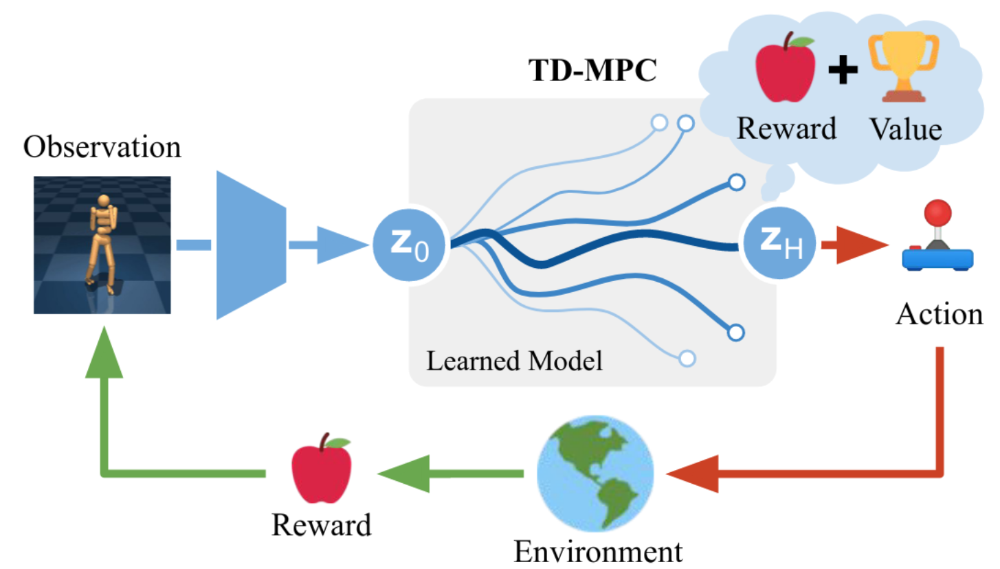
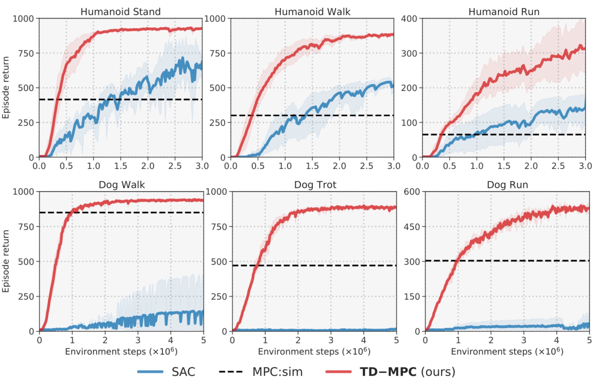

# Temporal Difference Learning for Model Predictive Control

Original PyTorch implementation of **TD-MPC** from

[Temporal Difference Learning for Model Predictive Control](https://arxiv.org/abs/2203.04955) by

[Nicklas Hansen](https://nicklashansen.github.io), [Xiaolong Wang](https://xiaolonw.github.io)\*, [Hao Su](https://cseweb.ucsd.edu/~haosu)\*


<p align="center">
  <br><br>
   <a href="https://arxiv.org/abs/2203.04955">[Paper]</a>&emsp;<a href="https://nicklashansen.github.io/td-mpc">[Website]</a>
</p>


## Method

**TD-MPC** is a framework for model predictive control (MPC) using a Task-Oriented Latent Dynamics (TOLD) model and a terminal value function *learned jointly* by temporal difference (TD) learning. TD-MPC plans actions entirely in latent space using the TOLD model, which learns compact task-centric representations from either state or image inputs. TD-MPC solves challenging Humanoid and Dog locomotion tasks in 1M environment steps.

<p align="center">
  
</p>


## Citation

If you use our method or code in your research, please consider citing the paper as follows:

```
@article{Hansen2022tdmpc,
	title={Temporal Difference Learning for Model Predictive Control},
	author={Nicklas Hansen and Xiaolong Wang and Hao Su},
	eprint={2203.04955},
	archivePrefix={arXiv},
	primaryClass={cs.LG},
	year={2022}
}
```

## Instructions

Assuming that you already have [MuJoCo](http://www.mujoco.org) installed, install dependencies using `conda`:

```
conda env create -f environment.yaml
conda activate tdmpc
```

After installing dependencies, you can train an agent by calling

```
python src/train.py task=dog-run
```

Evaluation videos and model weights can be saved with arguments `save_video=True` and `save_model=True`. Refer to the `cfgs` directory for a full list of options and default hyperparameters, and see `tasks.txt` for a list of supported tasks. We also provide results for all 23 state-based DMControl tasks in the `results` directory.

The training script supports both local logging as well as cloud-based logging with [Weights & Biases](https://wandb.ai). To use W&B, provide a key by setting the environment variable `WANDB_API_KEY=<YOUR_KEY>` and add your W&B project and entity details to `cfgs/default.yaml`.


## Changelog

* **[08-29-2022]** Added safeguard against NaNs in rare cases. Fixed an issue that caused multi-dimensional observation spaces to be inferred incorrectly.
* **[03-27-2022]** Reduced memory usage in pixel experiments by 6x. Code improvements. Refactoring. Update default pixel hyperparameters.
* **[03-10-2022]** Initial code release.

## License & Acknowledgements

TD-MPC is licensed under the MIT license. [MuJoCo](https://github.com/deepmind/mujoco) and [DeepMind Control Suite](https://github.com/deepmind/dm_control) are licensed under the Apache 2.0 license. We thank the [DrQv2](https://github.com/facebookresearch/drqv2) authors for their implementation of DMControl wrappers.
